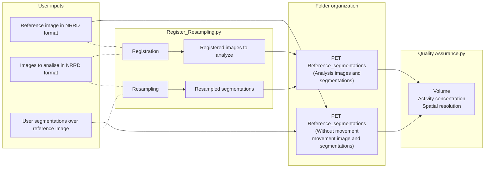
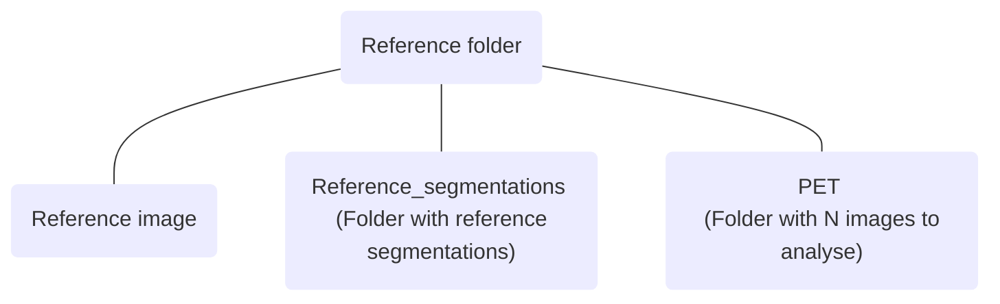
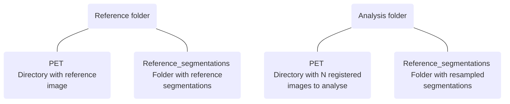

# QUALITY ASSURANCE

A python package for volume, concentration of activity and spatial resolution quantification in PET images.

This document provides an in-depth description of the package and its design choices. For a higher-level overview, we refer the reader to README.md

## Project description

The purpose of this project is to evaluate PET image quality in terms of volume accuracy, activity concentration
accuracy and spatial resolution, using phantoms. The project was originally applied to compare images with motion compensation.
However, other possible applications include quality comparisons among different systems, or different reconstruction techniques.

The project contains four blocks: User inputs, Register and Resampling, Folder organization and Quality Assurance. 
On User inputs the neccesary images to run the package are described. Register and Resampling explains the use of the
input images to run Register_Resampling.py. Folder organization shows the necesary organization of the images used in 
the next block, Quality assurance, where PET image quality analysis is explained. The dotted lines represent the inputs
of Register and resampling, while the solid lines represent the inputs of Quality assurance.
# Input requirements
 To run this package, the user needs:

 - A reference image (benchmark, static).

 - Segmentations created around volumes of interest (VOI) in the reference image.

 -  Any number of images to analyse.

All the images and segmentations must be in NRRD format. For our application we used an image taken without phantom movement as the reference image,
six reference segmentations and several tens of motion compensated images for each quantification analysis.

# Description and use of the scripts

## Register and Resampling
For the analysis ahead, the images must be filed as follows:

Register and Resampling is the previous step to Quality Assurance. Register_Resampling.py
is first used to register the N images to analyse to the reference image (register option). If the images have different
size than the reference image, then the segmentations must be resampled to one of the images to analise (resampling option).
For both types of analysis, a window will appear asking for:

 - Image directory (reference image for register/analysis image for resampling)

 - Register or resampling folder directory (PET for register/Reference_segmentations for resampling)

All the images and segmentations must be in NRRD format. For the analysis ahead, the images must be filed as follows:

While the reference and analysis folder can have any name desired, the PET and Reference_segmentations folders must be named as stated.
## Quality assurance
With Quality_Assurance.py the user can choose between volume, activity concentration and spatial resolution quantification.
The inputs necessary to run this script are:

 - Reference folder directory

 - Analysis folder directory

 - For volume: voxel size in mm3 for reference image and the N images

 - For activity concentration: Reference image and N images study times
 - Name of the excel file that the script will create with the results.

# Volume quantification

The script will obtain the volume of the VOIs inside each segmentation user-created, for all segmentations and
all images. The volume of each VOI is obtained by applying a region growing algorithm [1] with a threshold to the image
voxels inside the segmentation [2-4]. The threshold value used is the 40% of the mean of all voxels inside the segmentation with
intensity higher than the 70% of the maximum intensity. The seed of the region growing algorithm is the voxel with
highest intensity of the segmentation.

The new segmentation is then saved as a NRRD file with the name format:

TS_nameofsegmentation_nameofimage.nrrd

Its volume is also calculated and used to obtain the  volume recovery coefficient (RCVA), which is:

The script will compute the RCVA for all original segmentations and all N images to analyse. Volumes and
RCVA will be saved in an excel file. In our application, we used six manual reference segmentations around the six spheres
of the NEMA IEC body phantom to obtain the final sphere segmentations and compare their volume in the motion compensated images
to the volume in the reference image through RCVA. 

# Activity concentration quantification

The script will obtain the mean intensity value and standard deviation (STD) of each reference segmentation, for the reference
image and the N images to analise. It will correct the intensity by the activity decay and then compute the activity
concentration recovery coefficient (RCVA):

The intensities, STD and RCVA will be saved in an Excel file. In our application we obtained the mean activity concentration
of the segmentations created around six fillable inserts of the Electron Density Phantom (CIRS) in the reference image and the
motion compensated images to obtain RCVA for each segmentation and image.

# Spatial resolution

The script will use each segmentation to calculate the mean intensity of two thresholds:

 - Background (Bg): Intensity lower to 40% of the highest intensity of the voxels inside the segmentation

 - Activity (FDG): Intensity higher to 40% of the highest intensity of the voxels inside the segmentation

It will save the Background as a segmentation and calculate the number of clusters (rods) in it. Each of the segmentations
will be named as follows:

BG_nameofsegmentation_nameofimage.nrrd

The script will calculate the number of rods recovery coefficient (RCR) and contrast:

It will save in an Excel file:

 - Mean Bg activity

 - Mean FDG activity

 - Contrast

 - Contrast RC

 - RCR

 - Number of rods

 - STD Bg

 - STD FDG

In out application we used six segmentations around each of the rod sectors in the Flangeless Esser PET phantom to compare
the number of rods detected per sector in the images acquired with motion compensation protocols with the rods per
sector in the reference image.

The complete workflow is shown in the next figure:

 ## References

 [1] Adams R, Bischof L. Seeded region growing. IEEE Transactions on Pattern Analysis and Machine Intelligence. 1994;16:641–647.

 [2] Erdi YE, Mawlawi O, Larson SM, Imbriaco M, Yeung H, Finn R, Humm JL. Segmentation of lung lesion volume by adaptive positron emission tomography image thresholding. Cancer: Interdisciplinary International Journal of the American Cancer Society. 1997 Dec 15;80(S12):2505-9.

 [3] Zaidi H, El Naqa I. PET-guided delineation of radiation therapy treatment volumes: a survey of image segmentation techniques. European journal of nuclear medicine and molecular imaging. 2010 Nov;37(11):2165-87.

 [4] Tamal M. Intensity threshold based solid tumour segmentation method for Positron Emission Tomography (PET) images: A review. Heliyon. 2020 Oct 1;6(10):e05267.
 
 