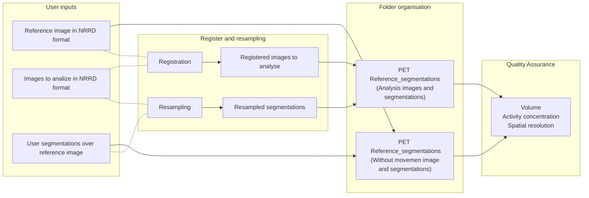

# Quality-Assurance
                                      

— - - https://github.com/AndreaMovilla/Quality-Assurance - - - 

> A package containing tools for automatic quantification analysis of NRRD PET images.

Quality_Assurance.py performs an analysis of the quality of PET images compared to a reference image. 

The quality can be assessed in terms of volume accuracy, activity concentration accuracy and spatial resolution. This document gives a quick overview of the structure of the package. A detailed explanation of the quantification analysis and instructions can be found in the "Aditional Documentation" file.

---

REFERENCES:

---

AUTHOR: Andrea Martínez Movilla <movillandrea@gmail.com>

---

HISTORY:

Version 1.0: February 2022

---



The workflow of this repository is organized in four blocks: User inputs, Register and Resampling, Folder organisation and Quality Assurance. Everything is explained in sections in the file called "Aditional documentation". On the User inputs section the neccesary images to run the package are described. Register and Resampling explains the use of the input images to run Register_Resampling.py. Folder organisation shows the necesary organisation of the images used in the next block, Quality assurance, where PET image quality analysis is explained. The dotted lines represent the inputs of Register and resampling, while the solid lines represent the inputs of Quality assurance.

This package was created using Python 3.7. It contains 2 folders:

1. ‘Automatic registration and resampling’: Python scripts to perform automatic registration and resampling of several PET images images at once .
	
	- Register_Resampling.py: script that runs the type of analysis desired: register or resampling

	- ARR_funtions.py: file containing all the functions used in the scripts of this folder.

	- Automatic_registration.py: Script to perform a basic automatic registration of images contained in a specific folder. 

	- Automatic_resampling.py: Script to perform a basic automatic resampling of segmentations contained in a specific folder. 

	To run  ‘Automatic registration and resampling’: Install requirements.txt, for example, using pip:
	
	```
	$ pip install -r requirements.txt
	```
	
	Open Register_Resampling.py. An emergent window will appear, asking the user to choose between register and resampling. Another emergent window will appear, asking for the directories needed for the type of analysis chosen. An output folder with the registered images or resampled segmentations will appear in the script folder.


2. ‘Quantification_Analysis’: Python scripts to perform volume, activity concentration and resolution quantification analysis of several PET images at once. 
	
	- Quality_Assurance.py: script that runs the type of quantification desired.

	- QA_functions.py: file containing all the functions used in the scripts of this folder.
	
	- QA_Volumes.py: script to perform volume quantification analysis. 

	- QA_Activity.py: script to perform activity concentration quantification analysis. 

	- QA_Resolution.py: script to perform resolution quantification analysis. 


	Before running, it’s important to organize the directories as follows:

	directory_to_reference_image/PET (containing without movement image)
	
	directory_to_reference_image/Reference_segmentations (containing segmentations based on image without movement)

 
	directory_to_images/PET (containing images to analyse)
	
	directory_to_images/Reference_segmentations (containing segmentations resampled)


	All images must be in NRRD format.

	To run ‘Quantification_analysis’: Install requirements.txt. Open and run Quantification_Analysis.py. An emergent window will appear. It will ask you to 	choose the type of analysis desired: volume, activity or resolution. Another emergent window will appear, asking for the input needed for the type of 		quantification chosen. After adding the input click “run”. It will automatically create in the script directory an output folder with the results obtained.
	

